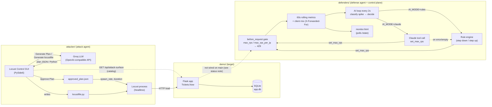

# Agentic Traffic Defense System

A10 hackathon project: an LLM-assisted Locust "attacker" sends bot traffic at a demo ticketing site. A defender runtime watches requests per second, classifies traffic spikes, and adjusts a rate limit using either rules or Claude tool calls.

> **Current status on `main`:** the defender package (`defenders/`) is complete, but `demo/app.py` at commit `56538c9` does **not** import it. That means the rate limiting, `/state`, `/monitor`, `/tools/set_max_rps`, and `/api/attack-surface` routes are not served right now. The last commit with the full wiring is `3458f42` (`git show 3458f42:demo/app.py`). The rest of this README describes the code as written and points out where that gap matters.

## Repository layout

| Path | What it is |
|------|------------|
| `demo/` | Flask ticketing site ("Tickets.Now"): signup/login, three concerts, ticket purchases backed by SQLite (`demo/app.db`), with an optional simulated-slowdown mode. |
| `defenders/` | `Defender` runtime: per-second metrics, HTTP 429 rate limiting, attack classification, AI control loop, and the `monitor.html` live dashboard. |
| `attacker/` | `locustfile.py` (load generator) and `locust_control_gui.py` (PySide6 desktop app that plans attacks with a Groq-hosted LLM and launches Locust). |

## Architecture



### Attack agent (`attacker/`)

- **`locustfile.py`**: one `HttpUser` with `wait_time = between(1, 2)` that POSTs `/signup` with a random name, a unique email, and a random password. It does not set `X-Forwarded-For`, so every request comes from the same client IP from the defender's point of view.
- **`locust_control_gui.py`**: the "Locust Bot Control" window.
  - It fetches an attack-surface catalog from `GET <host>/api/attack-surface` into `target_catalog.json`. A copy is committed, so the GUI still works when that route isn't served.
  - **Generate Plan** asks a Groq model (default `llama-3.3-70b-versatile`) for a JSON plan: persona, spawn rate, duration, think times, and weighted actions. The plan is filtered against the catalog's `actions_allowlist`.
  - **Generate locustfile.py (LLM)** asks Groq to write a full Locust 2.x file for the chosen persona, validates it, and saves it over `attacker/locustfile.py`.
  - **Approve Plan** writes `approved_plan.json` and archives a copy in `approved_plans/`.
  - **Start Bots** runs `locust -f locustfile.py --headless -u <Users> -r <spawn_rate> -t <duration> --only-summary` and streams output to `locust-gui.log`. Only `spawn_rate` and `duration` come from the plan; the locustfile itself does not read the plan's actions.
  - It needs `GROQ_API_KEY` in `attacker/.env` (gitignored) or in the environment.

### Defense agent and control plane (`defenders/runtime.py`)

- **Gate:** `Defender.before_request(client_ip)` counts each request and returns HTTP 429 in two cases: the current second's total is over `max_rps`, or one client is over `max_rps_per_ip` (when that limit is enabled). The client is taken from the first `X-Forwarded-For` hop when `TRUST_X_FORWARDED_FOR=1`.
- **Metrics:** a 60-second window of allowed/blocked requests per second, plus a rolling log of client IDs used for top-client stats.
- **AI loop:** every 2 seconds it averages the last 5 seconds of RPS. Above `AI_RPS_THRESHOLD`, it labels the spike as one of:

  | Label | Meaning |
  |-------|---------|
  | `distributed_flood` | Many distinct clients and no dominant one |
  | `single_client_flood` | One client dominates, or very few clients send high volume |
  | `mixed_high_volume` | High volume with concentration in between |
  | `sustained_high_rps` | Not enough samples yet to classify |

  It then lowers `max_rps`. When traffic is back under the threshold, it raises `max_rps` toward the cap.
- **Decision source:** `AI_MODE=rules` (default) steps the limit down or up by fixed amounts. `AI_MODE=claude` sends the metrics to Anthropic with a single `set_max_rps` tool and falls back to the rules if the call fails or returns nothing.
- **Dashboard:** `monitor.html` polls `/state` every second. It charts allowed (green) against blocked (red) RPS and shows top clients, the attack label, recovery state, and the AI decision log.

#### Defender settings

| Variable | Default | Effect |
|----------|---------|--------|
| `MAX_RPS` | `250` | Starting global requests-per-second cap |
| `MAX_RPS_PER_IP` | `0` (off) | Per-client cap within one second |
| `TRUST_X_FORWARDED_FOR` | `1` | Use the first `X-Forwarded-For` hop as the client ID |
| `AI_MODE` | `rules` | `rules` or `claude` |
| `AI_RPS_THRESHOLD` | `80` | 5-second average RPS that counts as an attack |
| `AI_MIN_MAX_RPS` / `AI_MAX_MAX_RPS` | `50` / `1000` | Lowest and highest `max_rps` the loop will set |
| `AI_STEP_DOWN` / `AI_STEP_UP` | `50` / `25` | Rule-engine step sizes |
| `ATTACK_DIST_MIN_IPS`, `ATTACK_DIST_MAX_TOP_SHARE`, `ATTACK_SINGLE_MIN_TOP_SHARE` | `15`, `0.38`, `0.42` | Classification thresholds |
| `ANTHROPIC_API_KEY`, `ANTHROPIC_MODEL` | none, `claude-3-5-sonnet-20241022` | Needed only for `AI_MODE=claude` |

### Demo site (`demo/app.py`)

| Route | Notes |
|-------|-------|
| `GET /` | Event listing with tickets remaining |
| `GET /auth`, `POST /signup`, `POST /login`, `GET /logout` | Session auth; passwords hashed with PBKDF2 |
| `GET /dashboard`, `GET /concert1`–`/concert3` | Require login |
| `POST /buy/<concert_id>` | Form field `quantity`; each concert has 100 tickets, enforced in code and by SQLite triggers |

`DEMO_MODE=1` adds an artificial delay on the routes above. The delay grows once more than `DEMO_CAPACITY` (8) requests are in flight, which simulates a site that degrades under load. Related settings: `DEMO_BASE_DELAY`, `DEMO_DELAY_PER_USER`, `DEMO_MAX_DYNAMIC_DELAY`, `DEMO_DELAY_MIN`, `DEMO_DELAY_MAX`.

`demo/show_users.py` prints the `users` table.

## Running it

Requirements: Python 3.10+ (the defender uses `X | None` type hints).

```bash
git clone https://github.com/jomiarockiasamy/Agentic-Traffic-Defense-System.git
cd Agentic-Traffic-Defense-System
python3 -m venv .venv
source .venv/bin/activate
pip install -r attacker/requirements.txt   # flask, locust, PySide6, openai, python-dotenv
pip install anthropic                      # only for AI_MODE=claude
```

**1. Start the demo site** (port 5000; the database is created on first run):

```bash
cd demo
python app.py                  # or: DEMO_MODE=1 python app.py
```

Open http://127.0.0.1:5000/.

**2. Start the attacker GUI** (optional, needs a Groq key):

```bash
echo 'GROQ_API_KEY=...' > attacker/.env   # gitignored; never commit it
./attacker/run_gui.sh                     # uses ./.venv/bin/python
```

Set **Target Host** to `http://127.0.0.1:5000`, then click **Generate Plan**, **Approve Plan**, and **Start Bots**.

**3. Defender and monitor:** on a build where `demo/app.py` imports `defenders` (for example `3458f42`), the monitor is at http://127.0.0.1:5000/monitor and the raw state is at `/state`. To use Claude:

```bash
export ANTHROPIC_API_KEY=...
AI_MODE=claude python app.py
```

## Load test

Run Locust headless against the demo with an HTML report:

```bash
# terminal 1
cd demo && python app.py

# terminal 2
mkdir -p results
locust -f attacker/locustfile.py --host http://127.0.0.1:5000 \
  --headless -u 300 -r 30 -t 2m \
  --html results/locust_report.html --csv results/locust
```

What to keep in mind when reading the results:

- The bundled `locustfile.py` only exercises `POST /signup`, which runs a PBKDF2 password hash and a SQLite write, so it's a CPU-heavy endpoint. Each user waits 1–2 seconds between requests, so 300 users produce about 150–300 requests per second at most.
- `app.run(debug=True)` is Flask's single-process development server. Latency measured against it shows what this demo does on one machine, not what a production deployment would do.
- With the defender wired in, anything above `max_rps` gets HTTP 429. Those responses are fast and pull latency percentiles down, so report the failure rate together with p50 and p95.
- `DEMO_MODE=1` adds deliberate delay, so leave it off when you measure baseline latency.

No benchmark numbers are published in this README. Use the generated `results/locust_report.html` as the source for any latency claims.

## Security notes

- `app.secret_key` is hardcoded (`demo-secret-key`). That's fine for a local demo, but don't deploy it as is.
- `TRUST_X_FORWARDED_FOR=1` lets any client choose its own identity. Only enable it behind a proxy that sets or strips that header.
- Keep `GROQ_API_KEY` and `ANTHROPIC_API_KEY` in `.env` files or environment variables. Both `.env` and `attacker/.env` are gitignored.
